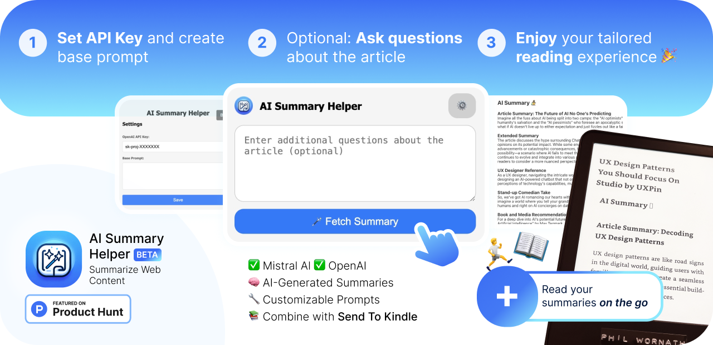
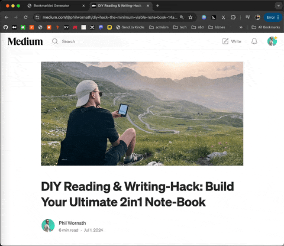

<link href="style.css" rel="stylesheet">
<!-- #  AI Summary Helper  -->
<h1 style="display: flex; align-content: center; align-items: center; gap: 12px;">AI Summary Helper</h1>

>You are on the hunt for interesting articles around the web, open 100 tabs and end up… not reading them. Sounds familiar?

Summary Helper allows to summarize articles with a custom prompt - so it can be as tailored to your language, profession or point of view as you define it. The summary gets inserted in the content area itself. This way you can easily forward the artice including the generated summary to your Kindle device e.g. using [Reabbles Send-to-Kindle tool](https://send.reabble.com/). 

 

>On the go I am way more likely to engage with the content I intentionally selected earlier. The tailored briefing then helps me to recall why I chose the article, suggests me books and other media related to it. 

sh.png)

**Variant A:** [Create your Bookmarklet](https://philffm.github.io/ai-summary-helper/bookmarklet-generator/) 
- Browser & OS-agnostic, even works on iOS 

**Variant B:** [Download Chrome Browser Plugin](https://chromewebstore.google.com/detail/ai-summary-helper-summari/hldbejcjaedipeegjcinmhejdndchkmb)

## Overview

This project includes two components:
- **Chrome Extension**: A browser plugin for generating AI summaries of web content.
- **Bookmarklet Generator**: A tool for creating bookmarklets that provide AI summaries.

|  | Bookmarklet  | Browser Extension |
| --- | --- | --- |
| OpenAI | ✅ | ✅ |
| Mistral AI | ✅ | ✅ |
| Custom Prompt | 🟠 Initially set base prompt | ✅ Base + custom prompt per request|
| Cross Platform | ✅ | ❌|

## Project Structure

- `chrome-extension/`: Contains the files for the Chrome extension.
- `bookmarklet-generator/`: Contains the files for the bookmarklet generator.
- `privacy.md`: Privacy policy for the project.

## Installation and Usage

### Chrome Extension

1. Navigate to the `chrome-extension` directory and follow the instructions in the `readme.md`.

### Bookmarklet Generator

1. Navigate to the `bookmarklet-generator` directory and follow the instructions in the `readme.md`.

## Feature Agenda 🚀

Bookmarklet generator generally ships faster since it is faster to iterate on.

### Browser Plugin

### Bookmarklet Generator 
- [x] Save API Key in Browser
- [x] iOS compatibility 
- [x] Select dom element by clicking to make insertion-point be definable by user
- [x] Add status state
- [ ] Include update mechanism (make the bookmarklet check this repo for a newer script) 
- [ ] Support other providers (on-device? What are some local LLMs we could use for this / API through localhost?)

## Privacy Policy

The privacy policy for this project is available in the [Privacy section](/chrome-extension/privacy.md).

## License

2024 Phil Wornath - [MIT License](LICENSE)
