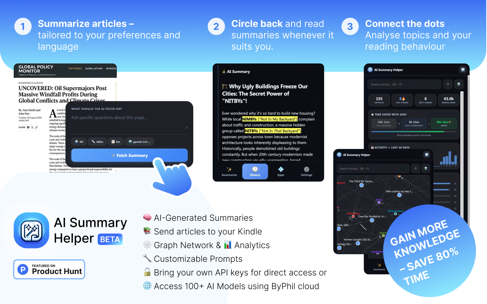
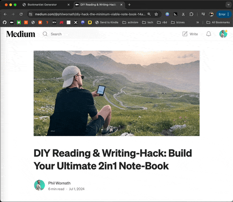

<link href="style.css" rel="stylesheet">
<!-- #  AI Summary Helper  -->
<h1 style="display: flex; align-content: center; align-items: center; gap: 12px;">AI Summary Helper</h1>

>You are on the hunt for interesting articles around the web, open 100 tabs and end up… not reading them. Sounds familiar?

Summary Helper allows to summarize articles with a custom prompt - so it can be as tailored to your language, profession or point of view as you define it. The summary gets inserted in the content area itself. This way you can easily forward the article including the generated summary to your Kindle device e.g. using [Reabbles Send-to-Kindle tool](https://send.reabble.com/). 

<a href="https://www.producthunt.com/posts/ai-summary-helper?embed=true&utm_source=badge-featured&utm_medium=badge&utm_souce=badge-ai&#0045;summary&#0045;helper" target="_blank"></a> 
<a href="https://chrome.google.com/webstore/detail/ai-summary-helper-summari/hldbejcjaedipeegjcinmhejdndchkmb" target="_blank"></a><a href="https://philffm.github.io/ai-summary-helper/bookmarklet-generator/" target="_blank"></a>


>On the go I am way more likely to engage with the content I intentionally selected earlier. The tailored briefing then helps me to recall why I chose the article, suggests me books and other media related to it. 



**Variant A:** [Create your Bookmarklet](https://philffm.github.io/ai-summary-helper/bookmarklet-generator/) 
- Browser & OS-agnostic, even works on iOS 



**Variant B:** [Download Chrome Browser Plugin](https://chromewebstore.google.com/detail/ai-summary-helper-summari/hldbejcjaedipeegjcinmhejdndchkmb)


## Overview

This project includes two components:
- **Chrome Extension**: A browser plugin for generating AI summaries of web content.
- **Bookmarklet Generator**: A tool for creating bookmarklets that provide AI summaries.

|  | Bookmarklet  | Browser Extension |
| --- | --- | --- |
| OpenAI | ✅ | ✅ |
| Mistral AI | ✅ | ✅ |
| Ollama (Local) | ❌ | ✅ |
| Custom Prompt | 🟠 Initially set base prompt | ✅ Base + custom prompt per request|
| Cross Platform | ✅ | ❌|
| Text Highlighting | ❌ | ✅ |
| Article History & Archive | ❌ | ✅ |
| Save for Later (Tab Close) | ❌ | ✅ |
| Context Menu Actions | ❌ | ✅ |
| Backup & Restore | ❌ | ✅ |


## Project Structure

- `src/`: Single source of truth for the WebExtension (Chrome MV3, Vanilla JS).
- `platforms/`: Per-platform manifests & artifacts (Firefox, iOS/Safari).
- `scripts/build.js`: Syncs `src/` to per-platform build targets.
- `bookmarklet-generator/`: Contains the files for the bookmarklet generator.
- `privacy.md`: Privacy policy for the project.

## Installation and Usage

### Chrome Extension

1. Navigate to the `src` directory and follow the instructions in the `readme.md`.

### Firefox Extension

1. Run `npm run build:firefox` (or `node scripts/build.js firefox`) to sync `src/` into `dist/firefox/` with the Firefox manifest.
2. Open `about:debugging#/runtime/this-firefox` in Firefox and click **Load Temporary Add-on**, then select `dist/firefox/manifest.json`.

### Safari (iOS / macOS)

1. Run `npm run build:ios` (or `node scripts/build.js ios`) to sync `src/` into `dist/ios/`.
2. Convert the WebExtension into a native container app:
   ```bash
   xcrun safari-web-extension-converter dist/ios \
     --app-name "AI Summary Helper" \
     --bundle-identifier "eu.byphil.aisummaryhelper" \
     --platform ios
   ```
3. In Xcode, ensure the extension target bundle ID starts with the parent app's bundle ID (e.g. `eu.byphil.aisummaryhelper.extension`), select the same signing team for both targets, and run on a concrete device/simulator (not "Any iOS Device").

### Bookmarklet Generator

1. Navigate to the `bookmarklet-generator` directory and follow the instructions in the `readme.md`.


## Feature Agenda 🚀

Bookmarklet generator generally ships faster since it is faster to iterate on.

### Browser Plugin

- [x] Summarize page via popup or keyboard shortcut
- [x] Custom prompt per request + saved default prompt
- [x] Multi-language summary output
- [x] Summary length slider
- [x] Article history with search and graph visualization
- [x] Text highlighting (yellow / AI ghost highlights) with per-page persistence
- [x] Enable/disable highlighting toggle in settings
- [x] Context menu: Highlight selection, Remove all highlights, Summarize page, Summarize & close tab
- [x] **Save for Later** — right-click any tab → "Summarize & Close": generates summary, saves with timeframe reminder (tomorrow / weekend / week / research session), closes the tab, shows in history with metadata
- [x] **RSVP Speed-reading overlay** — while summarizing on close, the AI output streams word-by-word as a speed-reading display; adjustable speed (slow/medium/fast) saved between sessions
- [x] **Timed reminders** — Chrome notifications remind you to revisit saved articles at your chosen timeframe
- [x] Backup & Restore (v2 format: settings + full article history)
- [x] Inline mode ("Send to Kindle" friendly)
- [x] Native side panel support
- [x] Graph view of article archive (D3.js, keyword-based)
- [x] **Analytics Report** — reading activity heatmap, top topics, streaks, model usage stats, per-article or full-archive view
- [x] Multi-provider support: OpenAI, Mistral, Deepseek, Ollama, byphil Cloud (no API key needed)

### Bookmarklet Generator 
- [x] Save API Key in Browser
- [x] iOS compatibility 
- [x] Select dom element by clicking to make insertion-point be definable by user
- [x] Add status state
- [x] Support other providers (on-device? What are some local LLMs we could use for this / API through localhost?)
    - [x] Ollama
- [ ] Include update mechanism (make the bookmarklet check this repo for a newer script) 


## Privacy Policy

The privacy policy for this project is available in the [Privacy section](/src/privacy.md).

## License

2024 Phil Wornath - [MIT License](LICENSE)

## Troubleshooting

### Configuring CORS for Ollama (The "Failed to Fetch" Error)

It looks like you've hit the classic CORS (Cross-Origin Resource Sharing) wall. Even though the configuration is correct, the browser blocks requests from websites (like arxiv.org) to your local Ollama instance for security reasons because Ollama isn't explicitly saying "I allow requests from this website."

Since the extension's content script runs directly on the page, its "Origin" is the website you are visiting, and Ollama rejects it by default.

To fix this, you need to set the `OLLAMA_ORIGINS` environment variable. Here is the breakdown based on your operating system:

#### 1. Windows (Most Common Issue)

1. Quit Ollama entirely. Look for the Ollama icon in your System Tray (bottom right, near the clock), right-click it, and select **Quit**.
2. Open the Start Menu, search for "Edit the system environment variables," and open it.
3. Click **Environment Variables**.
4. Under User variables, click **New**:
   - Variable name: `OLLAMA_ORIGINS`
   - Variable value: `*`
5. Click **OK** on all windows.
6. **Crucial:** Open a new Terminal or Command Prompt and type `ollama serve` (or simply relaunch the Ollama app from the Start menu).

#### 2. MacOS

1. Quit Ollama from the Menu Bar icon.
2. Open Terminal and run:
   ```bash
   launchctl setenv OLLAMA_ORIGINS "*"
   ```
3. Restart the Ollama application.

*Note: To make this permanent, you usually need to add that line to your `~/.zshrc` or `~/.bash_profile`.*

#### 3. Linux (Systemd)

If you are running Ollama as a service:

1. Run `sudo systemctl edit ollama.service`.
2. Add these lines under the `[Service]` section:
   ```ini
   [Service]
   Environment="OLLAMA_ORIGINS=*"
   ```
3. Save and exit, then run:
   ```bash
   sudo systemctl daemon-reload
   sudo systemctl restart ollama
   ```

🧐 **Why is this happening?**
Browsers follow a "Same-Origin Policy." When the extension tries to fetch `localhost:11434`, the browser sends a "Preflight" request (an `OPTIONS` check) to see if the server allows it. If `OLLAMA_ORIGINS` isn't set, Ollama doesn't include the `Access-Control-Allow-Origin` header in its response, and the browser kills the request. Setting it to `*` tells Ollama to accept requests from any origin.

#### Use Ollama via HTTPS (Advanced)

If you are running Ollama on a remote server behind an HTTPS proxy (like Nginx, Apache, or Cloudflare), you normally **do not** need to set `OLLAMA_ORIGINS` on the server itself. Instead, ensure your proxy is configured to allow CORS headers:

- **Why?** Browsers block "Mixed Content" (requesting HTTP from an HTTPS site). Using an HTTPS endpoint for Ollama solves this.
- **How?** Add `Access-Control-Allow-Origin: *` to your proxy configuration settings.

For more detailed guidance, refer to the comprehensive guide on handling CORS settings in Ollama [here](https://medium.com/dcoderai/how-to-handle-cors-settings-in-ollama-a-comprehensive-guide-ee2a5a1beef0).


# Compatible Tools
<!-- table with tools, name, description, url -->
Tools that are compatible with AI Summary Helper.
Feel free to add your own tool to the list.

Name | Description | URL
--- | --- | ---
Reabble Send to Kindle | Send your summarized articles to Kindle. | https://send.reabble.com/
Web Clipper | Clip your summarized web pages to different places (e.g. OneNote, Notion, GitHub etc.) | https://clipper.website/
Inoreader | RSS Feed Reader | https://www.inoreader.com/

