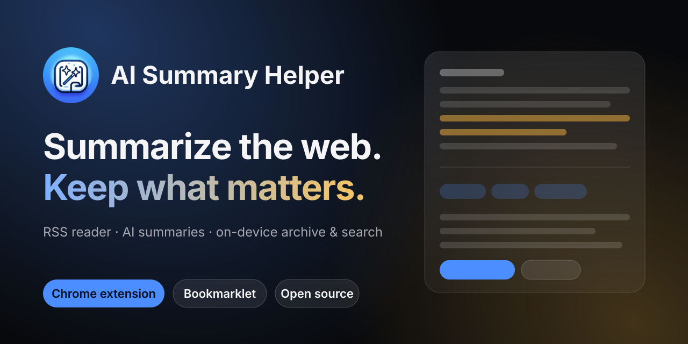
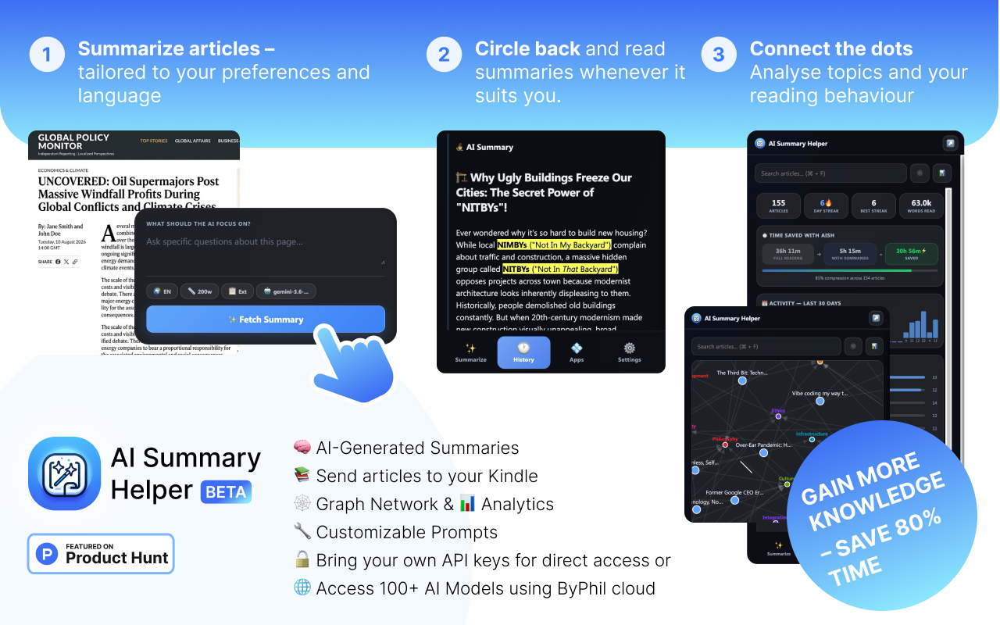
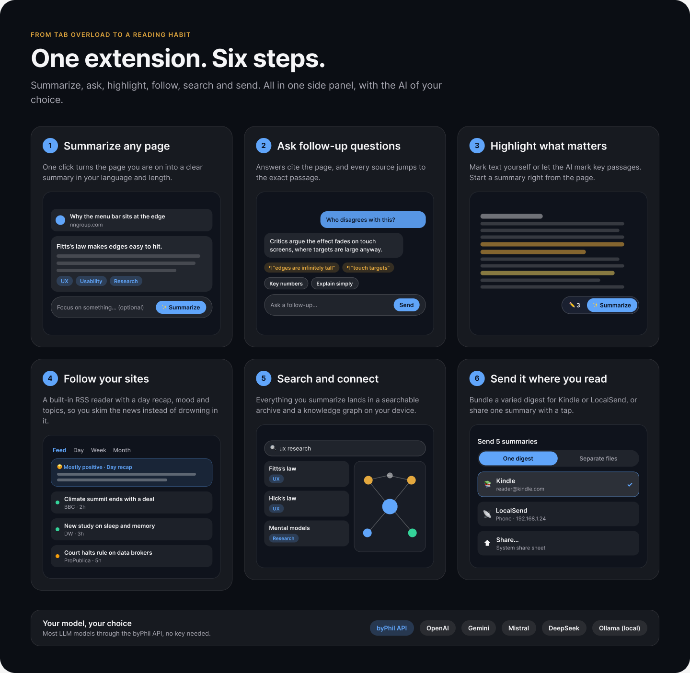
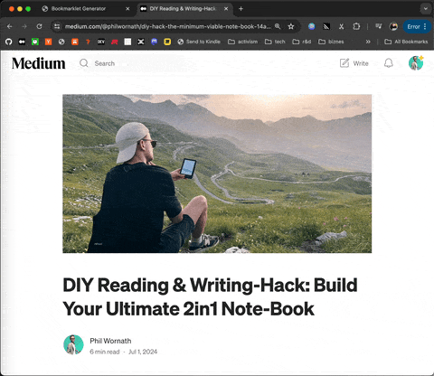
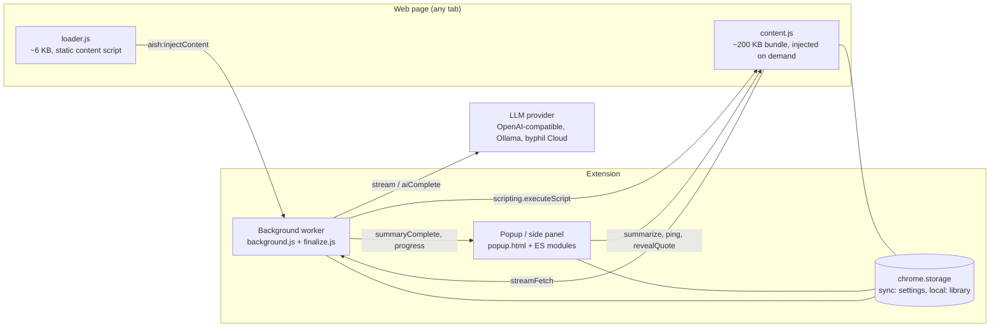

<p align="center">
  
</p>

<p align="center">
  <a href="https://chromewebstore.google.com/detail/ai-summary-helper-summari/hldbejcjaedipeegjcinmhejdndchkmb"></a>
  <a href="https://ai-summary-helper.byphil.eu/bookmarklet.html"></a>
  <a href="https://ai-summary-helper.byphil.eu/"></a>
</p>

<p align="center">
  <a href="LICENSE"></a>
  
  
  
  
</p>

> You are on the hunt for interesting articles around the web, open 100 tabs and end up… not reading them. Sounds familiar?

**AI Summary Helper** turns that pile into a reading habit. Summarize any page with the AI of your choice, follow your favorite sites in a built-in RSS reader, ask follow-up questions, and keep everything in a searchable archive that lives on your device. Then send a curated digest to your Kindle or another device, so you read what you picked on purpose.

<p align="center">
  
</p>

## Pick how you want to use it

|  | 🧩 **Browser extension** | 🔖 **Bookmarklet** |
| --- | --- | --- |
| Install | [Chrome Web Store](https://chromewebstore.google.com/detail/ai-summary-helper-summari/hldbejcjaedipeegjcinmhejdndchkmb), Firefox & Safari builds below | Nothing: drag one link to your bookmarks bar |
| Works on | Chrome, Edge, Firefox, Safari, Android | **Any browser and OS, even iOS** |
| Best for | Daily reading: history, search, RSS, highlights | Quick use on devices where extensions can't run |
| Get it | [**Add to Chrome**](https://chromewebstore.google.com/detail/ai-summary-helper-summari/hldbejcjaedipeegjcinmhejdndchkmb) | [**Create your bookmarklet**](https://ai-summary-helper.byphil.eu/bookmarklet.html) |

## How it works

<p align="center">
  
</p>

## What you get

- **Summaries with your model.** The byPhil API gives you access to most LLM models with no API key of your own. Or bring your own key for OpenAI, Gemini, Mistral, DeepSeek, or run Ollama locally.
- **Conversational summaries.** Ask follow-up questions; answers cite the page and jump to the exact passage. Pin the good ones into the summary.
- **Built-in RSS reader.** Follow sites, filter by source, tag, date or mood, import OPML, get an optional AI recap of the day.
- **Highlights and ghost highlights.** Mark text yourself or let the AI mark the key passages. Start a summary straight from the on-page highlights panel.
- **A searchable archive.** On-device full-text search, a knowledge graph of your saves, and an analytics report of your reading.
- **Read it later, on purpose.** "Summarize & Close" saves a tab with a reminder; the digest sends a varied selection to Kindle or LocalSend.
- **Your language.** 40+ summary languages (including Traditional and Simplified Chinese) and a localized interface.

> **How sending works.** *Send to Kindle* goes through the byPhil backend, because Amazon only accepts documents by email from approved senders: add `kindle@byphil.eu` to your approved senders in your Amazon account. The free tier includes 3 Kindle sends; unlimited Kindle sends require the [Support Pass](https://byphil.eu/#pass). *LocalSend* (and the system share sheet, e.g. AirDrop) is direct: the file goes from your browser to the device you pick, works with any device running a LocalSend-compatible app, and never touches our server. See the [privacy policy](privacy.md).

<a href="https://www.producthunt.com/posts/ai-summary-helper?embed=true&utm_source=badge-featured&utm_medium=badge&utm_souce=badge-ai&#0045;summary&#0045;helper" target="_blank"></a>

<details>
<summary><b>Bookmarklet in action</b></summary>



</details>

## Extension vs bookmarklet

|  | Bookmarklet  | Browser Extension |
| --- | --- | --- |
| OpenAI | ✅ | ✅ |
| Mistral AI | ✅ | ✅ |
| DeepSeek | ✅ | ✅ |
| Gemini | ✅ | ✅ |
| Ollama (Local) | ✅ | ✅ |
| byPhil Cloud (no API key) | ✅ | ✅ |
| Custom Prompt | ✅ | ✅ Base + custom prompt per request|
| Cross Platform | ✅ | ❌|
| Text Highlighting | ❌ | ✅ |
| Article History & Archive | ❌ | ✅ |
| Save for Later (Tab Close) | ❌ | ✅ |
| Context Menu Actions | ❌ | ✅ |
| Backup & Restore | ❌ | ✅ |

## Quick start for contributors

```bash
git clone https://github.com/philffm/ai-summary-helper.git
cd ai-summary-helper
npm ci
npm run build          # syncs plugin/src → plugin/dev/aish-extension-<platform>
npm test               # the jsdom tests a change can reach (quiet); `npm test -- 12 37` runs single tests, `npm run test:release` runs everything
npm run lint           # eslint plugin/src
node scripts/feed-i18n.mjs check   # every UI string translated in every locale
```

Pull requests run lint and the affected tests in CI (`main`, tags and a nightly run everything incl. the translation check); see [CONTRIBUTING.md](CONTRIBUTING.md) for conventions and [SECURITY.md](SECURITY.md) to report vulnerabilities. The privacy policy lives in `site-src/pages/privacy.html`; after editing it run `npm run privacy:build` to refresh the Markdown copies. Product and code audits: [`plugin/PRODUCT_AUDIT.md`](plugin/PRODUCT_AUDIT.md), [`plugin/PROJECT_AUDIT.md`](plugin/PROJECT_AUDIT.md), [`plugin/STYLE_AUDIT.md`](plugin/STYLE_AUDIT.md).

Load `plugin/dev/aish-extension-chrome/` via `chrome://extensions` → **Developer mode** → **Load unpacked**. The extension is vanilla ES modules, no framework and no bundler. The marketing site is plain HTML assembled by `npm run site:build` from `site-src/`.

## Install and build

### Chrome / Edge / Opera / Brave

Install from the [Chrome Web Store](https://chromewebstore.google.com/detail/ai-summary-helper-summari/hldbejcjaedipeegjcinmhejdndchkmb), or build it yourself: run `npm run build`, open `chrome://extensions`, enable **Developer mode**, click **Load unpacked** and pick `plugin/dev/aish-extension-chrome/`.

### Firefox Extension

1. Run `npm run build:firefox` (or `node plugin/scripts/build.js firefox`) to sync `plugin/src/` into `plugin/dev/aish-extension-firefox/` with the Firefox manifest.
2. Open `about:debugging#/runtime/this-firefox` in Firefox and click **Load Temporary Add-on**, then select `plugin/dev/aish-extension-firefox/manifest.json`.

### Safari (iOS / macOS)

1. Run `npm run build:ios` (or `node plugin/scripts/build.js ios`) to sync `plugin/src/` into `plugin/dev/aish-extension-ios/`.
2. Convert the WebExtension into a native container app:
   ```bash
   xcrun safari-web-extension-converter ./plugin/dev/aish-extension-ios \
   --project-location plugin/dist/ios \
   --app-name "AI Summary Helper" \
   --bundle-identifier "eu.byphil.aisummaryhelper" \
   --copy-resources \
   --force
      

   ```
3. In Xcode, ensure the extension target bundle ID starts with the parent app's bundle ID (e.g. `eu.byphil.aisummaryhelper.extension`), select the same signing team for both targets, and run on a concrete device/simulator (not "Any iOS Device").

### Bookmarklet Generator

The bookmarklet generator lives on its own page: [ai-summary-helper.byphil.eu/bookmarklet.html](https://ai-summary-helper.byphil.eu/bookmarklet.html) (the landing page only teases it). It supports both **byPhil Cloud** (email magic-code login, no API key) and **bring-your-own-key** providers (OpenAI, DeepSeek, Mistral, Gemini, Ollama). The generated bookmarklet always inserts the summary on the page and can optionally share it via the system share sheet, Send to Kindle (byPhil Cloud proxy), or Send to LocalSend (direct P2P). It also checks `bookmarklet-version.json` on each run and warns when it is outdated.

The generator's source lives in `site-src/pages/bookmarklet.html` (markup) and `docs/assets/main.js` (the `/* ── Bookmarklet generator */` component). The HTML pages are assembled from `site-src/` into `docs/` by `npm run site:build`, and GitHub Pages serves `docs/`. Do not edit the generated `docs/*.html` or `docs/lang/` by hand; the `translate.yml` workflow rebuilds them on every push to `main` that touches `site-src/`.

## Architecture

AISH is a Manifest V3 extension with four runtime parts that talk to each other only through `chrome.runtime` messages and `chrome.storage`. There is no server of our own in the loop when you bring your own key or use Ollama: the background worker calls the provider directly.


```mermaid
flowchart LR
  subgraph Page["Web page (any tab)"]
    L["loader.js<br/>~6 KB, static content script"]
    C["content.js<br/>~200 KB bundle, injected on demand"]
  end
  subgraph Ext["Extension"]
    P["Popup / side panel<br/>popup.html + ES modules"]
    B["Background worker<br/>background.js + finalize.js"]
    S[("chrome.storage<br/>sync: settings, local: library")]
  end
  LLM["LLM provider<br/>OpenAI-compatible, Ollama, byphil Cloud"]

  L -- "aish:injectContent" --> B
  B -- "scripting.executeScript" --> C
  P -- "summarize, ping, revealQuote" --> C
  C -- "streamFetch" --> B
  B -- "stream / aiComplete" --> LLM
  B -- "summaryComplete, progress" --> P
  C --- S
  P --- S
  B --- S
```

### The four parts

- **`loader.js` (every page).** The only script that runs on every page. It checks whether the page has saved highlights (`hl:all`) or the user selects text, and only then asks the background to inject the real content script. Android and iOS keep the full `content.js` as a static content script.
- **`content.js` (on demand).** Extracts the readable text (HTML, PDFs), paints highlights, shows the selection tooltip, and drives a summary run. It is injected by the background (`ensureContent`) when a highlight, a selection, the context menu, a shortcut, or the popup needs it, and is guarded against double injection.
- **Background worker.** Streams model output (`handleStreamFetch`, idle timeout only after the first chunk, so slow local models are fine), runs one-shot completions (`aiComplete` / `aiCancel`), polls feeds, hosts audio, and finishes a run whose page went away (`finalize.js` is bundled as a classic script for the worker).
- **Popup / side panel.** Plain HTML plus native ES modules. The main screen and its core modules load first; Feeds, History and Settings load right after the first paint.
- **Attach / detach.** On Chrome the header button docks the popup into the side panel (📌) and, inside the panel, undocks it back to a popup (↙️). It is the same `useNativeSidePanel` setting as Settings › Appearance; the panel loads `popup.html?surface=sidepanel` so the page knows where it runs (`modules/panelDock.js`). Firefox uses its own sidebar; Safari keeps the in-page sidebar.

### A summary, end to end

1. The popup asks the content script to summarize (injected first if needed).
2. The content script extracts the text and sends a `streamFetch` to the background, which streams the provider response back as progress.
3. `finalizeSummary` (`content/finalize.js`, shared by the page and the worker) cleans the model output into HTML and pulls out tags, ghost highlights, mood, a paper verdict, and **suggested follow-up questions with a short answer each** (`QUESTIONS: [{"q","a"}]`).
4. The result is saved (`articles:index` + one record per article) and relayed as `summaryComplete`.
5. The popup shows the card and the question chips. Tapping a chip types the stored short answer out like a person, while the background asks the model to **continue** that answer. The continuation streams in behind the typed text, a "Thinking more…" indicator with a Stop button covers the wait, and Stop keeps the short answer and cancels the request.

Models that ignore the `{q, a}` format still work: the parser accepts plain question strings and simply shows no short answer.

### Storage

All access goes through `StorageManager`; keys are defined once in `modules/storageKeys.js`.

| Area | Where | Notes |
| --- | --- | --- |
| Settings, flags, language, theme | `chrome.storage.sync` | small values only |
| Library index | `local` `articles:index` | lean list, never holds article text |
| Article record | `local` `articles:rec:<id>` | content, summary, `conversation`, `suggested`, `suggestedAnswers` |
| Highlights | `local` `hl:all` | one array for all pages, matched by `pageKeyForUrl` |
| Providers and keys | `local` `config:services` | per service: key, model, endpoint |
| Feeds | `local` `feeds:*` | subscriptions, items, recaps, UI state |

Reads are targeted (`StorageManager.get([keys])` routes each key to sync or local). `getAll()` is reserved for backup and first-run migration.

### UI, i18n, security

- **i18n.** The English text is the key (`T('Send me a code')`, `data-i18n` ids in `popup.html`). `node scripts/feed-i18n.mjs extract | merge <dir> | check` keeps the 13 locales complete.
- **Rendering.** Anything model- or page-derived that reaches `innerHTML` goes through `escapeHtml` (`modules/textUtils.js`); saved page and summary HTML shown in History goes through `cleanUntrustedHtml`.
- **Messaging.** The in-page sidebar (`popup.html` in an iframe) accepts `postMessage` only from its parent with the per-iframe token from its `#hash` (`modules/sidebarChannel.js`). Background actions that spend the AI key or fetch for the extension (`EXTENSION_PAGE_ACTIONS` in `background.js`) refuse content scripts.
- **Shared helpers.** `textUtils` (escape, word count), `dateUtils` (day, week, month), `dom` (element helpers), `suggestions` (follow-up parsing), `typewriter` (human-like typing).

### Tests

`npm test` runs the jsdom tests in `plugin/tests` that a change can reach (see `plugin/tests/affected.mjs`); `npm run test:release` runs all of them plus the audits (storage, popup flows, finalize, i18n coverage, loader). `plugin/tests/e2e/*.e2e.cjs` drive real Chromium with the built extension and need Playwright: `node plugin/scripts/build.js chrome` first, then run the script.

## Under the hood

<details>
<summary><b>Project structure and module responsibilities</b></summary>


```
ai-summary-helper/
├── plugin/                       # Shippable extension code (monorepo split)
│   ├── src/                      # Single source of truth (Chrome MV3, Vanilla JS)
│   │   ├── background.js         # Service worker: context menus, alarms, notifications, side panel
│   │   ├── loader.js             # Tiny static content script: injects content.js only when needed
│   │   ├── content.js            # Full content script (bundled, injected on demand): extraction, highlighting, summary run
│   │   ├── content/              # Content-script parts (extractor, highlighter, finalize, markdown, …)
│   │   ├── popup.html            # Popup UI (header → screens → bottom-nav)
│   │   ├── popup.js              # Popup entry point — wires up all module inits
│   │   ├── styles.css            # Global styles (glassmorphism, light/dark themes)
│   │   ├── api.js                # API helpers
│   │   ├── services.json         # Provider registry (OpenAI, Mistral, Deepseek, Ollama, …)
│   │   ├── prompts.json          # Preset prompt library
│   │   ├── compatible-tools.json # Compatible tools table (generated from readme)
│   │   ├── translations.json     # UI translation strings (source of truth)
│   │   ├── donationMessages.json # Donation message pool
│   │   ├── privacy.md            # Privacy policy
│   │   ├── readme.md             # Extension-specific readme
│   │   ├── _locales/             # i18n messages per locale (ar, de, en, es, fr, hi, it, ja, ko, pt_PT, ru, zh_*)
│   │   ├── icons/                # Extension icons (16/48/128 + svg)
│   │   ├── lib/                  # Vendored libs (e.g. d3.min.js)
│   │   └── modules/              # ES modules (see table below)
│   │
│   ├── platforms/                # Per-platform manifests
│   │   ├── chrome/manifest.json  # Chrome: sidePanel + service_worker
│   │   ├── android/manifest.json # Android: no sidePanel, service_worker
│   │   ├── firefox/manifest.json # Firefox: gecko id, background.scripts (event page)
│   │   └── ios/manifest.json     # Safari/iOS: background.scripts
│   │
│   ├── scripts/
│   │   ├── build.js              # Node dev-sync tool (src → dev/<platform>)
│   │   └── set-version.sh        # Stamps one version into manifests, current_version.json, popup.html
│   │
│   ├── build.sh                  # Release build: version bump + zip into prod/
│   │
│   ├── dev/                      # Generated unpacked builds (git-ignored)
│   │   ├── aish-extension-chrome/
│   │   ├── aish-extension-android/
│   │   ├── aish-extension-ios/
│   │   └── aish-extension-firefox/
│   │
│   └── prod/                     # Generated release zips (git-ignored)
│       ├── aish-extension-chrome-<ver>.zip
│       ├── aish-extension-android-<ver>.zip
│       └── aish-extension-firefox-<ver>.zip
│
├── site-src/                     # Website source: pages/ (English templates) + partials/ (nav, footer)
│   └── pages/privacy.html        # Single source of truth for the privacy policy (see scripts/privacy-md.mjs)
│
├── docs/                         # Marketing website (GitHub Pages publish folder, built from site-src/)
│   ├── index.html                # Landing page (generated; hero switch teases the bookmarklet)
│   ├── bookmarklet.html          # Bookmarklet generator page (generated)
│   ├── sitemap.xml               # SEO sitemap
│   ├── CNAME                     # Custom domain (ai-summary-helper.byphil.eu)
│   ├── assets/                   # Site JS/CSS + icons (main.js, styles.css, icon.svg, createBookmarklet.svg)
│   ├── bookmarklet-version.json  # Version manifest the bookmarklet checks for updates
│   ├── blog/                     # Marketing blog (static HTML)
│   ├── i18n/                     # Translation config + manifest (locales.json, manifest.json)
│   └── lang/                     # Website translations (generated by translate.mjs)
│
├── assets/                       # Repo-root marketing images (aish.png, demo.gif, createBookmarklet.svg)
│
├── scripts/
│   ├── build-site.mjs            # Assembles docs/*.html from site-src/ pages + partials
│   ├── seo.mjs                   # Canonical/hreflang tags and sitemap
│   ├── translate.mjs             # Website translation pipeline (docs/ → docs/lang/)
│   ├── feed-i18n.mjs             # Extension UI strings: extract | merge <dir> | check
│   └── privacy-md.mjs            # Generates privacy.md and plugin/src/privacy.md from site-src/pages/privacy.html
│
├── current_version.json          # Single source of truth for version + language list
├── package.json                  # npm scripts (build, build:chrome, build:firefox, …)
├── readme.md                     # This overview (also feeds compatible-tools.json)
├── privacy.md                    # Generated copy of the privacy policy (also bundled in the extension)
├── LICENSE                       # MIT
│
└── .github/workflows/
    ├── release.yml               # Tag-triggered: build + version bump + GitHub release
    ├── ci.yml                    # Pull requests: lint + affected tests. main / nightly / tags: all tests, audits, i18n
    └── translate.yml             # Auto-translates docs/ content → docs/lang/
```

#### `plugin/src/modules/` — ES module responsibilities

| Module | Responsibility |
| --- | --- |
| `uiManager.js`, `settingsNav.js`, `tabbar.js`, `sheet.js`, `dropdownMenu.js`, `confirmDialog.js` | Screens, bottom nav, settings home, tab bars, sheets with focus trap, menus, dialogs |
| `mainScreen.js`, `composerState.js`, `qaView.js`, `conversation.js` | Summarize screen: feed, composer states, follow-up thread, prompt building and answer parsing |
| `suggestions.js`, `typewriter.js` | Follow-up suggestions with short answers; human-like typing of the short answer |
| `feedManager.js`, `feedAi.js`, `feedRollup.js`, `feedParse.js`, `feedPlayer.js`, `feedInsights.js`, `feedMood.js`, `feedSentiment.js`, `feedUtil.js` | RSS reader, OPML, AI recaps, podcast player, insights, mood |
| `articleManager.js`, `archiveManager.js`, `archiveGraph.js`, `analyticsManager.js`, `topicsChart.js`, `historyMood.js`, `moodView.js`, `digestBuilder.js`, `annotationExporter.js` | History, knowledge graph, analytics, digests and exports |
| `settingsManager.js`, `modelManager.js`, `promptManager.js`, `promptSettings.js`, `promptBuilder.js`, `languageManager.js`, `moodSetting.js`, `workspaceManager.js` | Settings, providers and models, prompts, languages, workspaces |
| `authManager.js` | byphil Cloud sign-in (shared form for onboarding and Account, code boxes, plan card) |
| `storageManager.js`, `storageKeys.js`, `pageKey.js` | Storage abstraction, key registry, page keys for highlights |
| `sidebarChannel.js` | Token check for `postMessage` from the content script into the in-page sidebar |
| `panelDock.js` | Attach the popup to Chrome's side panel and detach it back |
| `localIntelligence.js`, `localSearch.js`, `tagIntelligence.js`, `duplicateDetector.js`, `textMetrics.js`, `textUtils.js`, `dateUtils.js`, `dom.js`, `log.js` | On-device search, tags, duplicates and shared helpers |
| `audioManager.js`, `podcastManager.js`, `readingTools.js`, `reader.js`, `instantRead.js`, `citation.js`, `paperInfo.js`, `sendSheet.js`, `localSendClient.js` | Read aloud, podcasts, reader, citations, send to devices |
| `i18n.js`, `feedI18n.js`, `languages.js`, `a11y.js`, `extensionApi.js` | Translations, language data, accessibility settings, browser API shim |

#### Build pipeline

- **Dev sync** — `node plugin/scripts/build.js` (bundles `content.js` and `finalize.js`; `loader.js` and the popup modules are copied as they are) (or `npm run build`) copies `plugin/src/` into `plugin/dev/aish-extension-<platform>/` and overlays the matching `plugin/platforms/<platform>/manifest.json`.
- **Release** — `./plugin/build.sh` bumps the version in `current_version.json` + all `plugin/platforms/*/manifest.json` + `plugin/src/popup.html` (via `plugin/scripts/set-version.sh`), then zips each platform build into `plugin/prod/`.
- **CI** — `.github/workflows/release.yml` runs lint, tests and `plugin/build.sh` on tag push, stamps the new version onto the latest `main` and pushes it (retrying from a fresh `main` if it moved, never overwriting), and creates a GitHub release with the three zips. Only one release runs at a time.

#### Cross-browser notes

- `plugin/src/` is written against the `chrome.*` namespace. A tiny shim at the top of `content.js`, `background.js`, and `popup.js` aliases `chrome → browser` when only `browser.*` exists (Safari/iOS), so the same code runs on every platform.
- Firefox uses `background.scripts` (event page) + a `gecko.id`; Chrome uses `service_worker` + `sidePanel`; Android/iOS omit `sidePanel`.


</details>

## Roadmap

<details>
<summary><b>Shipped features and checklist</b></summary>


Bookmarklet generator generally ships faster since it is faster to iterate on.

### Browser Plugin

- [x] Summarize page via popup or keyboard shortcut
- [x] Custom prompt per request + saved default prompt
- [x] Multi-language summary output
- [x] Summary length slider
- [x] Article history with search and graph visualization
- [x] Text highlighting (yellow / AI ghost highlights) with per-page persistence
- [x] Enable/disable highlighting toggle in settings
- [x] Context menu: Highlight selection, Remove all highlights, Summarize page, Summarize & close tab
- [x] **Save for Later** — right-click any tab → "Summarize & Close": generates summary, saves with timeframe reminder (tomorrow / weekend / week / research session), closes the tab, shows in history with metadata
- [x] **RSVP Speed-reading overlay** — while summarizing on close, the AI output streams word-by-word as a speed-reading display; adjustable speed (slow/medium/fast) saved between sessions
- [x] **Timed reminders** — Chrome notifications remind you to revisit saved articles at your chosen timeframe
- [x] Backup & Restore (settings + full article history; API keys and sign-in/license secrets excluded by default, with warned opt-in)
- [x] Inline mode ("Send to Kindle" friendly)
- [x] Native side panel support
- [x] Graph view of article archive (D3.js, keyword-based)
- [x] **Analytics Report** — reading activity heatmap, top topics, streaks, model usage stats, per-article or full-archive view
- [x] Multi-provider support: OpenAI, Mistral, Deepseek, Ollama, byphil Cloud (no API key needed)

### Bookmarklet Generator 
- [x] Save API Key in Browser
- [x] iOS compatibility 
- [x] Select dom element by clicking to make insertion-point be definable by user
- [x] Add status state
- [x] Support other providers (on-device? What are some local LLMs we could use for this / API through localhost?)
    - [x] Ollama
- [x] byPhil Cloud login (email magic code, no API key)
- [x] Dynamic model list from the byPhil Cloud API
- [x] Always insert summary on page + optional share (system share / Kindle / LocalSend)
- [x] Include update mechanism (bookmarklet checks `bookmarklet-version.json` and warns when outdated) 


</details>

## Troubleshooting

<details>
<summary><b>Ollama: “Failed to fetch” (CORS)</b></summary>

It looks like you've hit the classic CORS (Cross-Origin Resource Sharing) wall. Even though the configuration is correct, the browser blocks requests from websites (like arxiv.org) to your local Ollama instance for security reasons because Ollama isn't explicitly saying "I allow requests from this website."

Since the extension's content script runs directly on the page, its "Origin" is the website you are visiting, and Ollama rejects it by default.

To fix this, you need to set the `OLLAMA_ORIGINS` environment variable. Here is the breakdown based on your operating system:

#### 1. Windows (Most Common Issue)

1. Quit Ollama entirely. Look for the Ollama icon in your System Tray (bottom right, near the clock), right-click it, and select **Quit**.
2. Open the Start Menu, search for "Edit the system environment variables," and open it.
3. Click **Environment Variables**.
4. Under User variables, click **New**:
   - Variable name: `OLLAMA_ORIGINS`
   - Variable value: `chrome-extension://*,moz-extension://*,safari-web-extension://*`
5. Click **OK** on all windows.
6. **Crucial:** Open a new Terminal or Command Prompt and type `ollama serve` (or simply relaunch the Ollama app from the Start menu).

#### 2. MacOS

1. Quit Ollama from the Menu Bar icon.
2. Open Terminal and run:
   ```bash
   launchctl setenv OLLAMA_ORIGINS "chrome-extension://*,moz-extension://*,safari-web-extension://*"
   ```
3. Restart the Ollama application.
4. Check it (you should see `200`; `403` means Ollama has not picked up the setting yet, so quit and start it again):
   ```bash
   curl -s -o /dev/null -w "%{http_code}\n" http://localhost:11434/api/tags -H "Origin: chrome-extension://test"
   ```

**Make it permanent.** `launchctl setenv` is forgotten when you restart your Mac. This login item sets it again at every login:

```bash
cat > ~/Library/LaunchAgents/com.ollama.origins.plist <<'EOF'
<?xml version="1.0" encoding="UTF-8"?>
<!DOCTYPE plist PUBLIC "-//Apple//DTD PLIST 1.0//EN" "http://www.apple.com/DTDs/PropertyList-1.0.dtd">
<plist version="1.0"><dict>
<key>Label</key><string>com.ollama.origins</string>
<key>ProgramArguments</key><array><string>/bin/sh</string><string>-c</string>
<string>launchctl setenv OLLAMA_ORIGINS "chrome-extension://*,moz-extension://*,safari-web-extension://*"</string></array>
<key>RunAtLoad</key><true/>
</dict></plist>
EOF
launchctl load ~/Library/LaunchAgents/com.ollama.origins.plist
```

Then quit and restart Ollama once.

*Running `ollama serve` yourself while the Ollama app is still open fails with "address already in use". Quit the app first (or `pkill -x ollama`; `lsof -i :11434` shows what holds the port).*

#### 3. Linux (Systemd)

If you are running Ollama as a service:

1. Run `sudo systemctl edit ollama.service`.
2. Add these lines under the `[Service]` section:
   ```ini
   [Service]
   Environment="OLLAMA_ORIGINS=chrome-extension://*,moz-extension://*,safari-web-extension://*"
   ```
3. Save and exit, then run:
   ```bash
   sudo systemctl daemon-reload
   sudo systemctl restart ollama
   ```

🧐 **Why is this happening?**
Browsers follow a "Same-Origin Policy." When the extension tries to fetch `localhost:11434`, the browser sends a "Preflight" request (an `OPTIONS` check) to see if the server allows it. If `OLLAMA_ORIGINS` isn't set, Ollama doesn't include the `Access-Control-Allow-Origin` header in its response, and the browser kills the request. Setting it to the extension origins above tells Ollama to accept requests from browser extensions only, not from arbitrary websites. `*` also works but lets every website call your local Ollama.

#### Use Ollama via HTTPS (Advanced)

If you are running Ollama on a remote server behind an HTTPS proxy (like Nginx, Apache, or Cloudflare), you normally **do not** need to set `OLLAMA_ORIGINS` on the server itself. Instead, ensure your proxy is configured to allow CORS headers:

- **Why?** Browsers block "Mixed Content" (requesting HTTP from an HTTPS site). Using an HTTPS endpoint for Ollama solves this.
- **How?** Add `Access-Control-Allow-Origin: *` to your proxy configuration settings.

For more detailed guidance, refer to the comprehensive guide on handling CORS settings in Ollama [here](https://medium.com/dcoderai/how-to-handle-cors-settings-in-ollama-a-comprehensive-guide-ee2a5a1beef0).

</details>

## Privacy

Summaries go only to the AI provider you configure (or fully local with Ollama). Your archive, search index and settings stay on your device. Read the full [privacy policy](plugin/src/privacy.md).

## License

2024 Phil Wornath - [MIT License](LICENSE)

## Third-Party Libraries

This extension vendors the following open-source libraries under
`plugin/src/lib/`. Full license texts:
[THIRD_PARTY_LICENSES.md](plugin/src/lib/THIRD_PARTY_LICENSES.md)

| Library | Version | License | Source |
| --- | --- | --- | --- |
| pdf.js | 4.0.379 | Apache-2.0 | https://github.com/mozilla/pdf.js |
| D3.js | 7.9.0 | ISC | https://github.com/d3/d3 |
| AFINN-111 | — | Apache-2.0 | https://github.com/fnielsen/afinn |

> These libraries are vendored by hand (not via npm), so there's no
> automatic drift detection. When you replace any `lib/*` file, bump the
> version numbers above **and** in `THIRD_PARTY_LICENSES.md` — the table is
> the only record of what's actually shipped.

# Compatible Tools
<!-- table with tools, name, description, url -->
Tools that are compatible with AI Summary Helper.
Feel free to add your own tool to the list.

Name | Description | URL
--- | --- | ---
Reabble Send to Kindle | Send your summarized articles to Kindle. | https://send.reabble.com/
Web Clipper | Clip your summarized web pages to different places (e.g. OneNote, Notion, GitHub etc.) | https://clipper.website/
Inoreader | RSS Feed Reader | https://www.inoreader.com/
